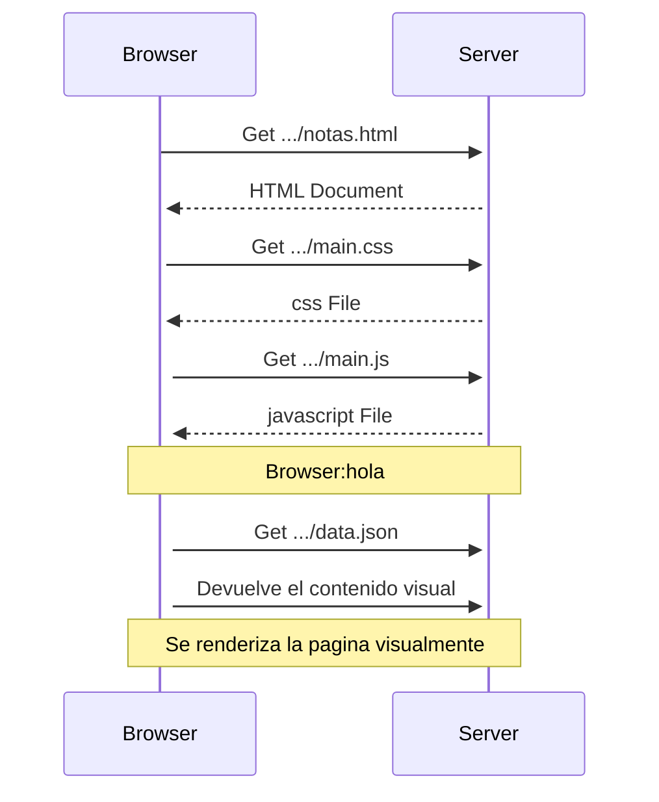

# Tarea 1
### Función del navegador, al escribir una tarea y hacer click en el botón submit.

```mermaid
sequenceDiagram

Browser->>+Server:Get .../notas.html;
Server-->>+Browser:HTML Document;
Browser->>+Server:Get .../main.css;
Server-->>+Browser: css File;
Browser->>+Server:Get .../main.js;
Server-->>Browser: javascript File;
Note over Browser,Server: Browser:hola
Browser->>+Server:Get .../data.json;
Browser->>+Server:Devuelve el contenido visual;
Note over Browser,Server: Se renderiza la pagina visualmente

```
