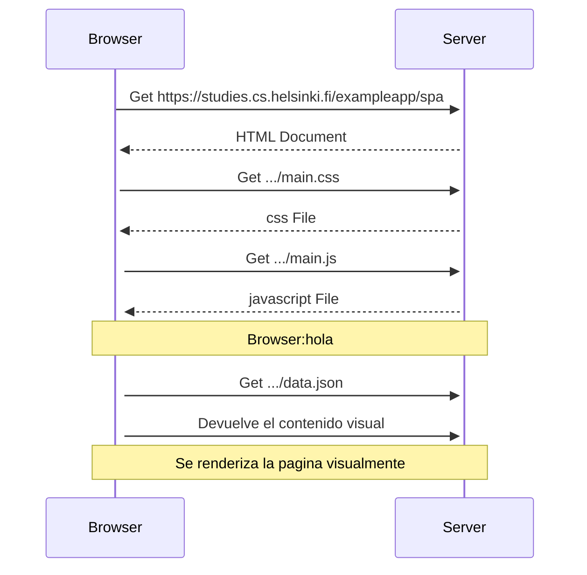

# Tarea 5
### Usuario va a la dirección https://studies.cs.helsinki.fi/exampleapp/spa

```mermaid
sequenceDiagram

Browser->>+Server:Get https://studies.cs.helsinki.fi/exampleapp/spa;
Server-->>+Browser:HTML Document;
Browser->>+Server:Get .../main.css;
Server-->>+Browser: css File;
Browser->>+Server:Get .../main.js;
Server-->>Browser: javascript File;
Note over Browser,Server: Browser:hola
Browser->>+Server:Get .../data.json;
Browser->>+Server:Devuelve el contenido visual;
Note over Browser,Server: Se renderiza la pagina visualmente
```
