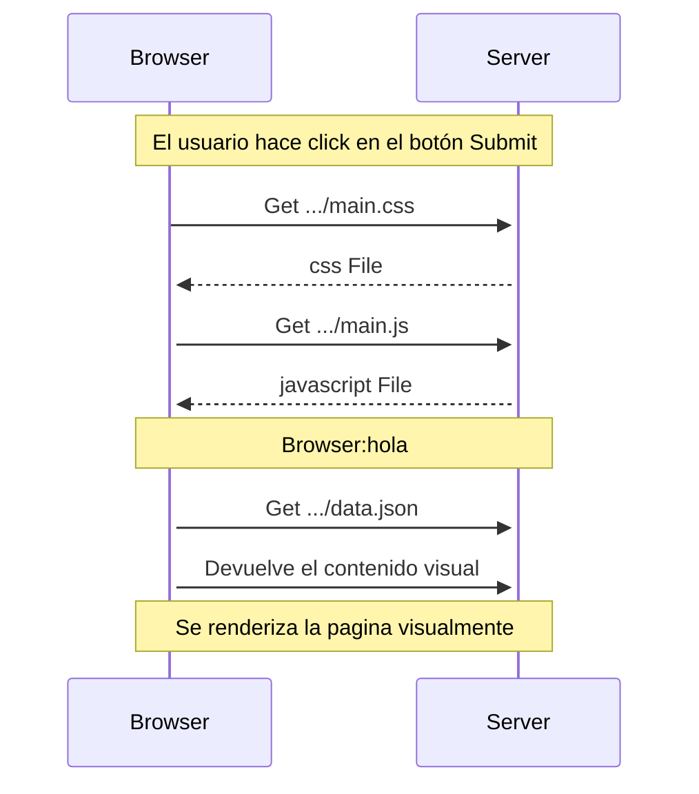

# Tarea 6
### Usuario crea una nueva nota en la versión de una sola página.

```mermaid
sequenceDiagram

Note over Browser,Server: El usuario hace click en el botón Submit
Browser->>+Server:Get .../main.css;
Server-->>+Browser: css File;
Browser->>+Server:Get .../main.js;
Server-->>Browser: javascript File;
Note over Browser,Server: Browser:hola
Browser->>+Server:Get .../data.json;
Browser->>+Server:Devuelve el contenido visual;
Note over Browser,Server: Se renderiza la pagina visualmente
```
